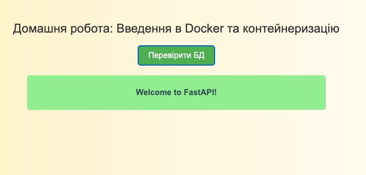

## Task01 ##
запуск скрипту:

`chmod +x task01/website_checker.sh`

`task01/website_checker.sh`

## Task02 ##

створення контейнерів:
`docker compose up -d --build`

далі переходимо за посиланням http://localhost:8000
і натискаємо на зелену кнопку

